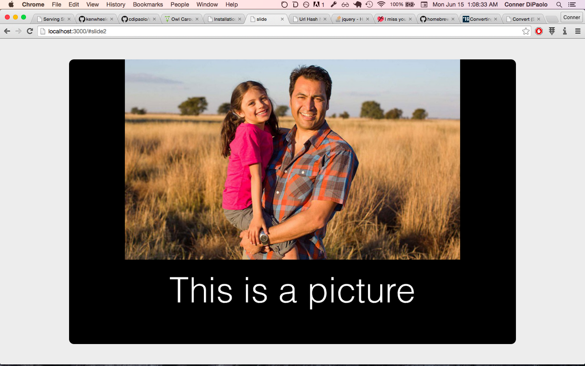

# slide

### present slides created in other programs nicely in a browser

`present` (a Golang tool) is great for creating clean, easy to make slides. But when you want to create well designed slides in another program (because let's be real, sometimes plain text and raw images don't cut it) it can be a hassle to get them running easily in a web browser and looking clean, and even harder to host them on a web server. Enter slide. Always spelled with a lowercase 's', especially at the beginning of sentences, slide helps people present things to the best of their ability. 

#### slide in action



#### status

Arrow key control over slides isn't working yet, but every other basic function is. Currently you drag to switch slides. I've spent only a day on this so far so it isn't enterprise ready (whatever that means for a single slideshow hosting platform.)

#### under the hood

Currently I'm taking the /www directory within this repo and converting that to binary data so that I can restore it onto the host machine within a temp directory (although you can use a permenant one if you want to host on a server persistantly, etc., though there really isn't much reason to because it 'recompiles' the static files every time you run the binary.) Before a Golang file server in instantiated, the www/ directory is first copied over to the host temp directory, and then the image/pdf slide directory specified (defaults to current working directory) is copied or converted (if the slides are a pdf, and needs image-magick for that) into the working directory under the naming scheme expected by the site's javascript.

Once the file server is listening on :3000 (or whatever else you set it to,) the JS checks which images exist under the expected naming schema and renders those slides under a custom Owl Carousel.

# installation

#### with `go get`

from your `$GOPATH`, with `$GOPATH/bin` in your `$PATH`:

```bash
$ go get github.com/cdipaolo/slide
$ go install ./...
$ cp bin/slide /usr/bin/slide

# now just use as normal!
```

# usage

place a pdf of your slideshow (created in whatever) as 'slides.pdf' or (with extensions JPG/JPEG/PNG) images of your slides (named *.png, *.jpg, or *.jpeg as long as the files will sort into the correct order) into a directory (lets call it `slide-dir` for now.) Run the following and open `localhost:3000` (it'll prompt you anyways.) 

That's it.

```bash
$ cd slide-dir
$ slide 
```

# license: MIT

see [LICENSE](LICENSE) for details.